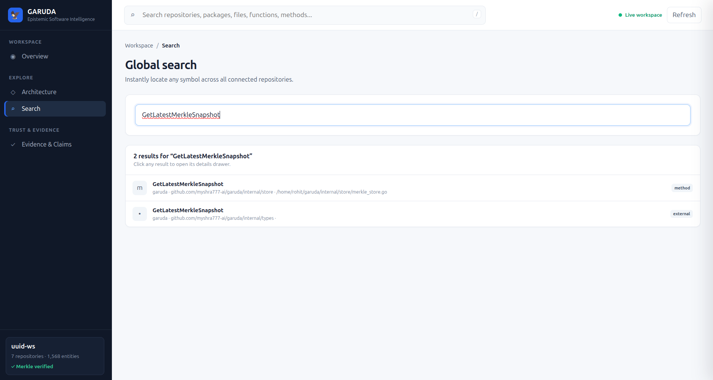
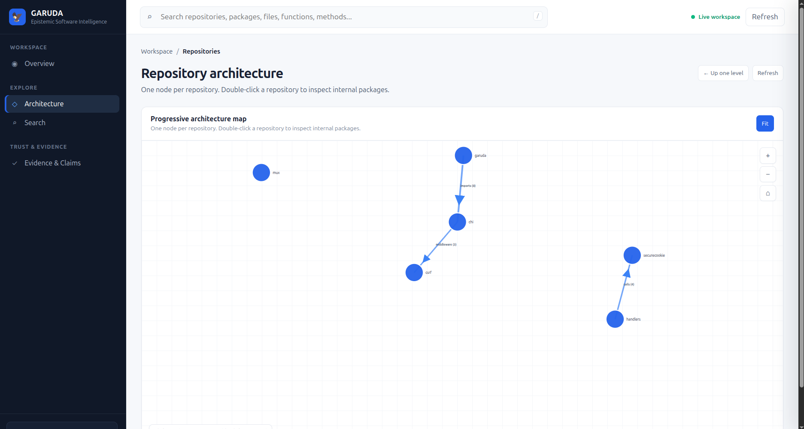
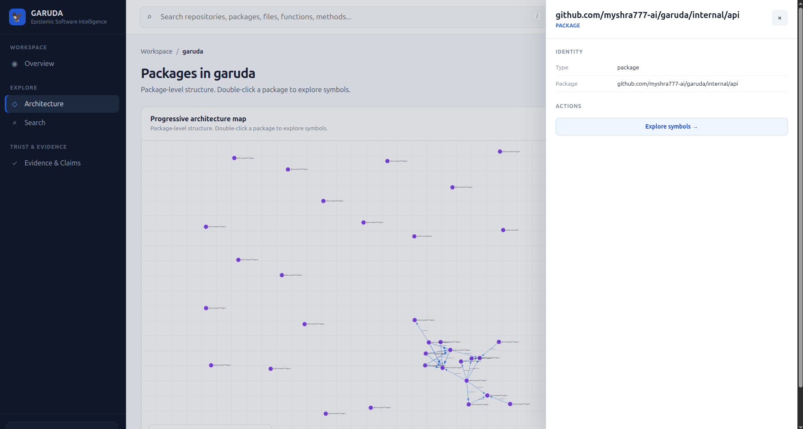
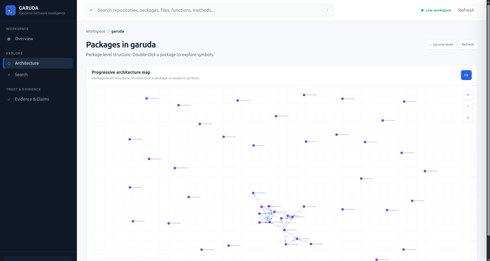
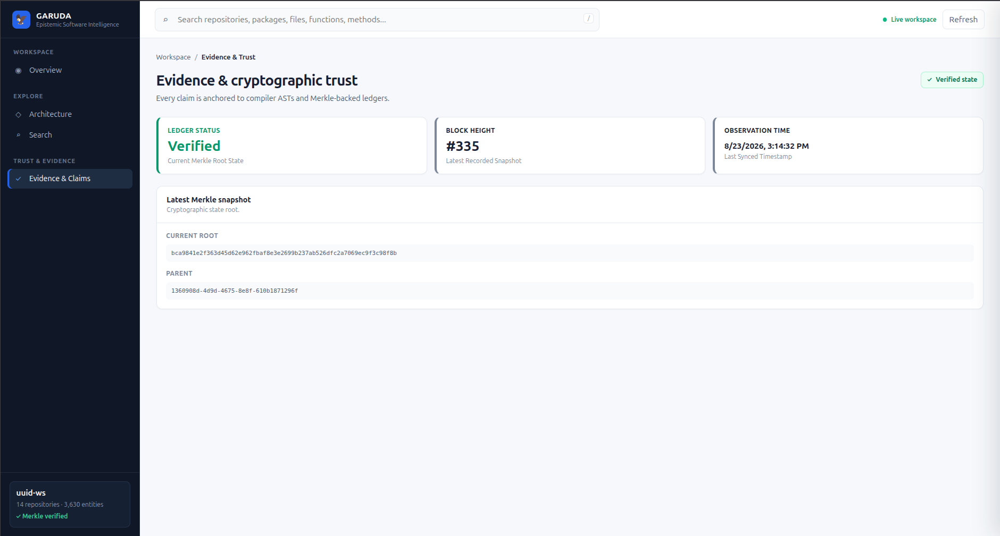
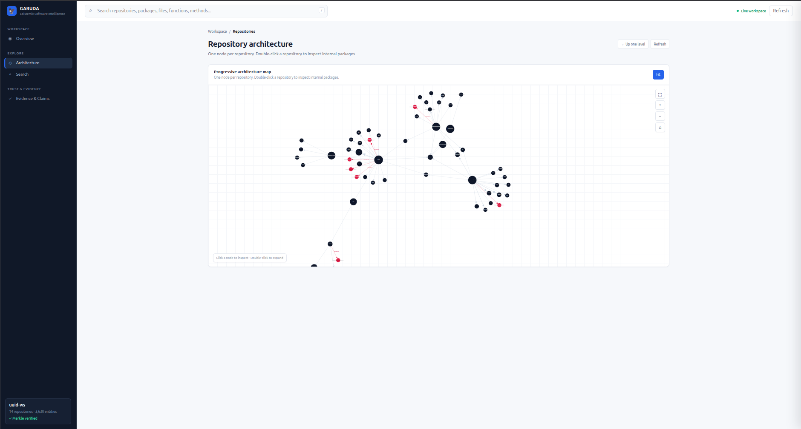

<p align="center">
  
</p>

<h1 align="center">Garuda</h1>

<p align="center">
  <strong>Evidence‑backed software intelligence.</strong>
</p>

<p align="center">
  Understand your software as a connected, inspectable, and verifiable system.
</p>

<p align="center">
  <a href="PLAYBOOK.md">Playbook</a> ·
  <a href="EVIDENCE.md">Evidence</a> ·
  <a href="docs/">Architecture</a> ·
  <a href="SECURITY.md">Security</a> ·
  <a href="CHANGELOG.md">Changelog</a>
</p>

---

## The short version

Modern software systems are no longer just source code. They are repositories, packages, symbols, dependencies, runtime behavior, architectural decisions, policies, history, and increasingly — AI agents making changes to them.

Most tools understand only one part of that system:

- Static analysis understands code.
- Search finds text.
- Dependency graphs show relationships.
- Observability shows runtime behavior.
- Documentation describes intent.
- AI agents reconstruct context from whatever they can retrieve.

**Garuda connects these layers into one persistent semantic and evidence‑backed workspace.**
SOFTWARE SYSTEM
│
┌─────────────────┼─────────────────┐
│ │ │
▼ ▼ ▼
SOURCE CODE REPOSITORIES RUNTIME
│ │ │
└────────────┬────┴────┬────────────┘
▼ ▼
SEMANTIC MODEL
│
▼
RELATIONSHIP GRAPH
│
▼
EVIDENCE LAYER
│
┌─────┴─────┐
▼ ▼
CLAIMS OBSERVATIONS
│ │
└─────┬─────┘
▼
VERIFICATION
│
┌───────────┼───────────┐
▼ ▼ ▼
SUPPORTED UNVERIFIED CONTRADICTED
│ │ │
▼ ▼ ▼
TRUSTED UNKNOWN QUARANTINED

text

The goal is simple:

> **Don't make software intelligence depend on guesses when the system can provide evidence.**

---

## Why Garuda?

Ask an AI agent: *“How does authentication work in this system?”*  
A model can search files and produce an answer. But what happens when:

- the repository contains multiple services?
- the implementation changed six commits ago?
- the important dependency lives in another repository?
- the code exists but has never been observed executing?
- runtime behaviour differs from the expected architecture?
- another agent already investigated the same subsystem?
- the answer needs to be tied to an exact source location?
- you need to know not only what exists, but what evidence supports the conclusion?

Garuda is designed for that layer. Instead of repeatedly asking models to reconstruct the software system from raw files, Garuda builds a persistent semantic representation that can be queried, inspected, verified, and progressively enriched with evidence.

---

## What Garuda builds

Garuda turns repositories into a structured software intelligence graph.
Repository
│
├── Packages
│ │
│ ├── Interfaces
│ ├── Structs
│ ├── Functions
│ └── Methods
│
├── Relationships
│ ├── CALLS
│ ├── IMPORTS
│ ├── REFERENCES
│ ├── CONTAINS
│ ├── DEFINES
│ ├── IMPLEMENTS
│ ├── EMBEDS
│ └── DEPENDS_ON
│
├── Evidence
│
├── Claims
│
├── Decisions
│
└── Runtime observations

text

The result is not simply a code index. It is a persistent model of **how the software is structured, how its pieces relate, what evidence exists, and what remains unknown**.

---

## The epistemic model

One of Garuda's core design decisions is that **unknown must remain unknown**. Garuda does not treat the absence of runtime evidence as proof that code is dead, broken, unused, or unsafe.

Runtime verification currently uses three states:

| State          | Meaning                                                                            |
| -------------- | ---------------------------------------------------------------------------------- |
| `SUPPORTED`    | Static structure and matching runtime evidence support the claim                   |
| `UNVERIFIED`   | The static structure exists, but sufficient runtime evidence has not been observed |
| `CONTRADICTED` | Observed runtime behaviour conflicts with the verified architectural relationship   |

This distinction matters.
Code exists
│
▼
No runtime evidence
│
▼
UNVERIFIED
│
└── not "broken"
└── not "dead"
└── not "safe"
└── not "unsafe"

Observed runtime behaviour
│
├── agrees with verified structure
│ │
│ ▼
│ SUPPORTED
│
└── deviates from verified structure
│
▼
CONTRADICTED

text

This is one of the foundations of Garuda:

> **Absence of evidence is not evidence of absence.**

---

## From static code to runtime evidence

Garuda's runtime direction extends the semantic graph with OpenTelemetry observations.
Application
│
▼
OpenTelemetry
│
▼
Garuda telemetry ingestion
│
▼
Runtime observations
│
▼
Entity correlation
│
▼
Static ↔ runtime verification
│
├── Supported
├── Unverified
└── Contradicted

text

Runtime ingestion is designed as an asynchronous pipeline. A telemetry request can be accepted quickly while verification and dashboard propagation happen separately.

### Current validation observation

- Telemetry admission: HTTP `202`
- Measured ingestion response: approximately `1.8 ms p95` under the tested workload
- Verification: asynchronous
- Dashboard propagation in current testing: approximately `1–2 minutes`

These are **measured observations from current validation**, not universal production SLAs. See [`EVIDENCE.md`](EVIDENCE.md) for methodology and detailed results.

---

## Contradiction detection

Garuda can ingest controlled runtime observations and compare them against the semantic state it already knows.
VERIFIED GRAPH

Application
│
▼
Service
│
▼
Approved database
│
▼
Repository

RUNTIME OBSERVATION

Application
│
▼
Service
│
▼
Unapproved database
│
▼
Runtime span

│
▼

CONTRADICTED
│
▼
QUARANTINE

text

Current validation includes **10 manually injected runtime observations** specifically used to exercise the contradiction engine. Those observations are separate from the static claim corpus.

The current controlled validation detected:

**10 / 10 injected contradictions**

This demonstrates the behaviour of the tested contradiction path; it is **not a claim of universal production recall**.

---

## Multi‑repository intelligence

Software rarely lives in one repository. Garuda supports workspaces containing multiple repositories and resolves relationships across repository boundaries.
┌──────────────┐
│ Repository A │
└──────┬───────┘
│
│ cross‑repository relationship
▼
┌──────────────┐
│ Repository B │
└──────┬───────┘
│
▼
┌──────────────┐
│ Repository C │
└──────────────┘

text

This enables a workspace‑level view of: repositories, packages, symbols, relationships, dependencies, cross‑repository bridges, evidence, and runtime observations. Instead of asking “What does this repository contain?” you can begin asking “How does this software ecosystem fit together?”

---

## Progressive architecture exploration

Large graphs become useless when everything is shown at once. Garuda uses progressive exploration:
Workspace
↓
Repositories
↓
Packages
↓
Entities
↓
Relationships
↓
Evidence

text

The dashboard is designed to move from a high‑level system view into progressively more detailed evidence.

---

## Garuda Workspace

<p align="center">
  
</p>

The workspace view provides: repository counts, package counts, entity counts, relationship counts, verification state, supported / unverified / contradicted claims, global search, architectural hubs, cross‑repository relationships, and recent evidence. The interface is intentionally designed for **progressive disclosure instead of graph overload**.

---

## Global search

<p align="center">
  
</p>

Garuda provides workspace‑wide search across semantic objects rather than treating the repository as a collection of text files. Search can traverse repositories, packages, files, functions, methods, interfaces, structs, and symbols. The current workspace search has been exercised against the validation corpus and is designed for fast interactive navigation.

---

## Architecture explorer

<p align="center">
  
</p>

Garuda's architecture views allow developers to move from `Workspace → Repository → Package → Entity → Relationship` without starting from a massive dependency hairball.

---

## Repository topology

<p align="center">
  
</p>

Topology views provide a structural overview of repositories and their relationships. This is useful for architecture reviews, dependency investigation, onboarding, change planning, impact analysis, and identifying highly connected components.

---

## Cross‑repository graph

<p align="center">
  
</p>

Garuda can surface cross‑repository relationships so that architectural boundaries are visible rather than hidden behind separate repository searches.

---

## Runtime evidence

<p align="center">
  
</p>

Runtime observations are incorporated into the same evidence‑oriented model used for static analysis. This allows the system to distinguish:
WHAT THE CODE SAYS
│
▼
WHAT THE GRAPH REPRESENTS
│
▼
WHAT RUNTIME OBSERVATIONS SHOW
│
▼
WHAT CAN CURRENTLY BE VERIFIED

text

---

## Cryptographic state

<p align="center">
  
</p>

Garuda uses append‑oriented state and cryptographic verification primitives to make system state inspectable and tamper‑evident. The trust layer is designed around immutable revisions, provenance, evidence references, Merkle state, verification, and lineage. The objective is not merely to say “Garuda thinks this is true.” It is to make it possible to ask: “What evidence supports this state, when was it recorded, and can the recorded state be cryptographically verified?”

---

## Garuda IDE

<p align="center">
  
</p>

<p align="center">
  
</p>

Garuda now includes an integrated developer interface for interacting with the semantic workspace. The IDE currently provides functional workflows around repository intelligence, search, architecture exploration, graph views, evidence, contradiction inspection, and Garuda workflows. The core workflows are functional and under active testing. Visual polish and workflow refinement are still ongoing.

### Status

**Early testing**

---

## IDE contradiction view

<p align="center">
  
</p>

The IDE brings the same evidence model closer to the developer workflow instead of requiring every investigation to happen from the command line or dashboard.

---

## Deterministic identity

Garuda assigns stable identities to semantic entities. The current Go analyzer uses compiler/type information and deterministic identity mechanisms to distinguish entities such as packages, structs, interfaces, functions, and methods. This matters because textual names are not enough. For example, `Handle()` may exist in multiple packages, repositories, or receiver contexts. Garuda's semantic identity model is designed to preserve those distinctions across the workspace.

---

## Evidence‑backed relationships

Garuda does not treat every graph edge as equally meaningful. Relationships can be traced back to the evidence that established them.
Entity A
│
│ CALLS
▼
Entity B
│
├── source location
├── repository
├── package
├── revision
└── supporting evidence

text

This makes the graph inspectable rather than merely visual.

---

## Impact analysis

When changing software, the question is rarely “What file am I editing?” The useful question is “What could this change affect?” Garuda provides impact and blast‑radius analysis around semantic entities.
Target Entity
│
├── callers
├── dependencies
├── dependents
├── related interfaces
├── repository boundaries
└── downstream relationships

text

Available through: `garuda impact` and `garuda impact-diff`.

---

## Semantic change analysis

Garuda can compare semantic snapshots rather than relying only on textual diffs: `garuda diff`, `garuda impact-diff`, `garuda evaluate`, `garuda judge`. This allows changes to be considered in terms of entities, relationships, dependencies, operational impact, and governance state rather than only lines added and removed.

---

## Decisions, policies, and lineage

Garuda also maintains a decision‑oriented layer: `garuda propose`, `garuda remember`, `garuda supersede`, `garuda explain`, `garuda justify`, `garuda lineage`, `garuda plan`. This allows the software system to retain not only “What exists?” but also “What was decided?” and “Why does this decision exist?” and “What evidence and lineage led here?”

---

## MCP and AI agents

Garuda exposes its semantic and evidence model to AI agents through Model Context Protocol workflows.
AI AGENT
│
▼
MCP
│
▼
GARUDA
│
┌───────────┼───────────┐
▼ ▼ ▼
SEMANTICS EVIDENCE STATE
│ │ │
└───────────┼───────────┘
▼
GROUNDED CONTEXT

text

The objective is not to replace the model. The objective is to give the model a **persistent, structured substrate from which to reason**. This can help agents spend less effort repeatedly reconstructing repository structure from raw files.

---

## AI context and expected token efficiency

Garuda is designed with an important economic hypothesis: **Persistent semantic context should reduce repeated repository exploration.** Today, an AI agent may repeatedly open files, search symbols, read dependencies, reconstruct architecture, and repeat in another session. Garuda can instead provide a persistent semantic graph with relevant entities, relationships, and evidence, leading to:

- less repeated repository exploration
- fewer redundant file reads
- fewer repeated structural explanations
- smaller targeted context windows
- better reuse of previously established software structure

### Important

Garuda does **not currently claim a universal token‑savings percentage**. The expected savings depend on repository size, task type, agent behaviour, model, context strategy, number of repeated investigations, and amount of code required per task. Garuda includes a grounding benchmark harness (`garuda bench`) to measure naive repository exploration vs. Garuda‑grounded exploration. Future benchmark results will be published as evidence rather than estimated as marketing claims.

---

## Validation

Garuda has been exercised across a progressively larger set of heterogeneous Go repositories.

| Metric                                        | Current validation |
| --------------------------------------------- | -----------------: |
| Repositories                                  |                 14 |
| Packages                                      |                143 |
| Entities                                      |              3,675 |
| Relationships                                 |              5,679 |
| Cross‑repository bridges                      |                 55 |
| Controlled runtime contradiction observations |                 10 |
| Contradictions detected                       |            10 / 10 |

These numbers represent the current validation corpus and should not be interpreted as universal production limits or guarantees. For the complete methodology, screenshots, test results, and historical runs: **[→ Open the Garuda Evidence Center](EVIDENCE.md)**.

---

## What has been tested

- **Semantic analysis** – across heterogeneous Go repositories to validate extraction and correlation.
- **Multi‑repository resolution** – as the workspace grew from smaller configurations to the current 14‑repository corpus.
- **Runtime contradiction testing** – 10 controlled observations injected, 10 detected.
- **Cryptographic state** – Merkle‑backed state progression and ledger verification across repeated worker cycles.
- **Telemetry ingestion** – asynchronous path exercised with OpenTelemetry spans and HTTP `202 Accepted` admission.
- **Search** – global workspace search tested interactively.
- **Dashboard** – workspace, architecture, graph, evidence, and contradiction views exercised against multi‑repository datasets.
- **IDE** – core workflows functional and currently in early testing and polish.

---

## Evidence, not just screenshots

The repository maintains a separate evidence layer so that the README does not become a benchmark notebook.

- **[EVIDENCE.md](EVIDENCE.md)** – validation results, methodology, scaling runs, runtime experiments, contradiction testing, telemetry measurements, cryptographic verification, charts, screenshots, and detailed reports.
- **[PLAYBOOK.md](PLAYBOOK.md)** – installation, initialization, workspace setup, repository management, analysis, graph exploration, impact analysis, telemetry, verification, MCP, IDE workflow, and complete CLI usage.
- **[docs/](docs/)** – deeper technical architecture documentation.
- **[SECURITY.md](SECURITY.md)** – security model and vulnerability reporting.
- **[CONTRIBUTING.md](CONTRIBUTING.md)** – development and contribution workflow.
- **[CHANGELOG.md](CHANGELOG.md)** – version history and implementation changes.

---

## Capability status

Garuda is evolving quickly, so capabilities are intentionally grouped by maturity instead of presenting an artificial numbered roadmap.

### Stable

Core capabilities that form the current semantic foundation: Go semantic analysis, compiler‑backed type resolution, deterministic entity identity, semantic relationships, repository and workspace modelling, evidence provenance, semantic snapshots, semantic diff, impact analysis, impact‑diff, lineage, cryptographic state verification, global workspace search, progressive architecture exploration, CLI workflows, and dashboard exploration.

### Early testing

Capabilities that are implemented and actively being validated: multi‑repository intelligence, OpenTelemetry ingestion, runtime observations, static ↔ runtime correlation, contradiction verification, runtime evidence views, MCP integration, Garuda IDE, grounding benchmark harness, and agent‑oriented workflows. These capabilities should be treated as **early testing rather than universal production guarantees**.

### Launching soon

The next product‑facing layer is focused on making Garuda easier to operate continuously: stronger CI integration, richer runtime verification, deeper MCP workflows, expanded evidence exploration, broader grounding benchmarks, production‑oriented telemetry workflows, developer workflow integrations, and stronger policy and governance automation.

### Longer‑term direction

Garuda is being developed toward a broader software intelligence substrate capable of connecting source, runtime, evidence, decisions, policies, AI agents, operational state, and governance. The long‑term direction includes company‑scale software graphs, multi‑language semantic intelligence, richer runtime correlation, stronger architectural governance, AI‑grounded software operations, business‑state integrity, and autonomous verification and remediation. These are directions, not current production claims.

---

## Command line

Garuda is designed to be usable from the terminal first. Run `garuda --help` for the complete command surface.

### Core commands

- `garuda analyze` – Analyse a Go codebase and extract its semantic model.
- `garuda init` – Initialize Garuda, run required setup, index the workspace, and configure supported MCP integrations.
- `garuda up` – Start the complete Garuda stack.
- `garuda dev` – Start the unified Garuda daemon.
- `garuda dashboard` – Open the web workspace.
- `garuda workspace` – Manage logical groups of repositories.
- `garuda repo` – Manage repositories inside a workspace.
- `garuda entities` / `garuda inspect` – Inspect entities.
- `garuda graph` – Generate an interactive graph.
- `garuda impact` / `garuda impact-diff` – Impact analysis.
- `garuda diff` – Compare semantic snapshots.
- `garuda evaluate` – Evaluate changes.
- `garuda judge` – Governance judgement.
- `garuda explain` – Explain why a decision or state exists.
- `garuda justify` – Inspect semantic relationships and provenance.
- `garuda lineage` – Query lineage.
- `garuda plan` – Generate structured plans.
- `garuda policies` / `garuda remember` / `garuda supersede` – Policy management.
- `garuda handoff`, `garuda propose`, `garuda recommend`, `garuda execute` – Agent workflows.
- `garuda ingest` – Runtime ingestion.
- `garuda mcp` – Run the Garuda MCP server over standard I/O.
- `garuda bench` – Run the grounding benchmark harness.
- `garuda ci` – Run Garuda in CI mode and compare against a baseline.
- `garuda verify` – Verify Garuda ledger integrity.
- `garuda status` – Inspect Merkle state and daemon status.
- `garuda summary` – Architectural summaries.
- `garuda ponytail` – Dead‑code / duplication analysis.
- `garuda self-describe` – Generate an evidence‑backed product description.

Use `garuda [command] --help` for command‑specific options.

---

## One‑click installation

Garuda includes a one‑command installation path.

```bash
curl -fsSL https://raw.githubusercontent.com/myshra777-ai/garuda/main/install.sh | sh
Then:

bash
garuda init
garuda up
For detailed installation and operational workflows: → Read the Garuda Playbook.

A typical Garuda workflow
text
                     START
                       │
                       ▼
                 garuda init
                       │
                       ▼
                  garuda up
                       │
                       ▼
                Add repositories
                       │
                       ▼
                garuda analyze
                       │
                       ▼
                Semantic graph
                       │
          ┌────────────┼────────────┐
          ▼            ▼            ▼
       Search        Impact       Graph
          │            │            │
          └────────────┼────────────┘
                       ▼
                    Evidence
                       │
                       ▼
                   Telemetry
                       │
                       ▼
                  Verification
                       │
            ┌──────────┼──────────┐
            ▼          ▼          ▼
        Supported   Unverified  Contradicted
                                   │
                                   ▼
                              Investigate
Example: understand a change
Imagine a developer changes a central interface.

Without a semantic system: edit file → search manually → guess dependencies → run tests → hope nothing important was missed.

With Garuda: target entity → semantic relationships → callers / dependencies → cross‑repository edges → impact analysis → semantic diff → evidence → runtime observations.

The goal is not to replace tests. The goal is to make the reasoning around the change inspectable.

Example: AI‑assisted development
Instead of an agent repeatedly doing “Where is this function?” → read file → “Where is it called?” → search → “Which interface implements this?” → search again → “Does another repository depend on it?” → search again, Garuda can provide a persistent semantic layer: entity → callers, implementations, dependencies, repository boundaries, evidence, lineage, and runtime state. This is the basis of Garuda's AI‑grounding thesis.

Design principles
Evidence over inference – Prefer inspectable evidence over opaque conclusions.

Unknown stays unknown – Do not turn missing evidence into certainty.

Identity must be deterministic – The same semantic entity should remain identifiable across analysis runs.

State should be auditable – Important state transitions should leave an inspectable trail.

Architecture should be navigable – A useful graph should help humans move from macro architecture to specific evidence.

Runtime and static knowledge are different – Static structure tells us what the code contains; runtime observations tell us what has been observed executing. They should not be conflated.

AI should consume structured truth – Agents should not have to rediscover the entire software system every time they work on it.

Correctness before scale – Garuda's architecture favours validated semantics and evidence before expanding scope.

What Garuda is not
Garuda is not trying to be: another text search engine, another code linter, another generic dependency graph, another observability platform, another documentation generator, another generic vector database, or an LLM that guesses how your repository works. Garuda sits between these layers. It is intended to become the semantic and evidence substrate connecting them.

Current scope
Garuda currently focuses primarily on Go. The semantic engine is built around compiler‑backed Go analysis and a persistent semantic model. Broader language coverage is a future expansion.

Project status
Garuda is actively evolving. The current system includes a functioning semantic analysis engine, persistent workspace model, relationship graph, evidence layer, cryptographic verification layer, multi‑repository workspace, dashboard, global search, impact analysis, CLI, telemetry ingestion path, runtime verification path, MCP interface, IDE, and benchmark harness. Some of the newer runtime, MCP, IDE, and AI‑grounding capabilities remain in early testing and should not be interpreted as universal production guarantees. The project is being validated continuously as the implementation expands.

Evidence center
We deliberately keep detailed validation material outside this README. That keeps the README readable while preserving the ability for engineers, evaluators, and investors to inspect the actual evidence.

Explore the evidence: EVIDENCE.md →
Includes validation runs, semantic precision testing, cross‑repository validation, telemetry experiments, runtime contradiction testing, cryptographic verification, search testing, dashboard screenshots, IDE screenshots, scaling charts, benchmark reports, and methodology.

Documentation
Document	Purpose
Playbook	Installation, commands, workflows, telemetry, MCP and IDE usage
Evidence	Validation results, benchmarks, screenshots and reports
Architecture	Technical architecture and design documentation
Security	Security model and vulnerability reporting
Contributing	Contribution and development workflow
Changelog	Project history and implementation changes
Repository structure
text
garuda/
│
├── README.md
├── PLAYBOOK.md
├── EVIDENCE.md
├── SECURITY.md
├── CONTRIBUTING.md
├── CHANGELOG.md
├── LICENSE
│
├── assets/
│   ├── screenshots/
│   │   ├── garuda_minimal_logo.png
│   │   ├── Dashboard_overview_workspace_active14repo_and_10_contradictions.png
│   │   ├── global_search.png
│   │   ├── repository-topology.png
│   │   ├── top_level_repo_architecture.png
│   │   ├── cross-repo-graph.png
│   │   ├── dashboard-14repo-contradictions.png
│   │   ├── evidence-cryptographic-trust.png
│   │   ├── top-level-repo-graph.png
│   │   ├── ide-graph-view.png
│   │   └── ide-contradictions.png
│   │
│   └── ...
│
├── docs/
├── cmd/
├── internal/
├── migrations/
├── garuda-bench/
├── test/
└── scripts/
Contributing
Garuda is being built in the open. If you are interested in compiler tooling, developer infrastructure, semantic graphs, runtime verification, OpenTelemetry, MCP, AI coding agents, software architecture, provenance systems, cryptographic state, or developer experience, there are many interesting problems to work on. Start with CONTRIBUTING.md.

Security
Security issues should be reported according to SECURITY.md. Garuda treats provenance, state integrity, authentication boundaries, and evidence integrity as first‑class engineering concerns.

License
Garuda is released under the Apache License 2.0. See LICENSE.

The direction
Software is becoming increasingly dynamic. Repositories multiply. Dependencies cross organizational boundaries. Runtime behaviour diverges from assumptions. AI agents increasingly modify production systems. And every new agent creates another potential source of duplicated context and reasoning.

Garuda is being built around a different model:

text
              SOFTWARE
                  │
       ┌──────────┼──────────┐
       ▼          ▼          ▼
      CODE      RUNTIME    INTENT
       │          │          │
       └──────────┼──────────┘
                  ▼
             GARUDA GRAPH
                  │
              EVIDENCE
                  │
             VERIFICATION
                  │
        ┌─────────┼─────────┐
        ▼         ▼         ▼
      HUMAN      AI      SYSTEMS
The long‑term goal is not simply to make software easier to search. It is to make software easier to understand, verify, change, and reason about without repeatedly reconstructing the same reality from scratch.

<p align="center"> <strong>Garuda</strong><br> Evidence‑backed software intelligence. </p><p align="center"> <sub> Built around a simple rule: <strong>if the system can provide evidence, don't replace it with a guess.</strong> </sub> </p>
Disclaimer
This document describes the current state of Garuda as of the latest validation run. All metrics, performance figures, and capabilities are based on specific test environments and controlled workloads. While we strive for accuracy and reliability, actual results may vary depending on your repository structure, hardware, network conditions, and usage patterns.

Any forward‑looking statements, including expected token savings, performance improvements, or future capabilities, are not guarantees and should not be relied upon for production readiness without your own validation. We encourage you to run the included benchmark harness (garuda bench) and review the detailed evidence in EVIDENCE.md to form your own assessment.

Garuda is evolving rapidly, and we continuously test and refine the system. Your feedback and contributions are invaluable to making it more robust and useful.

<p align="center"> <sub> <strong>Version:</strong> v0.1.2 · <strong>License:</strong> Apache 2.0 </sub> </p> ```
